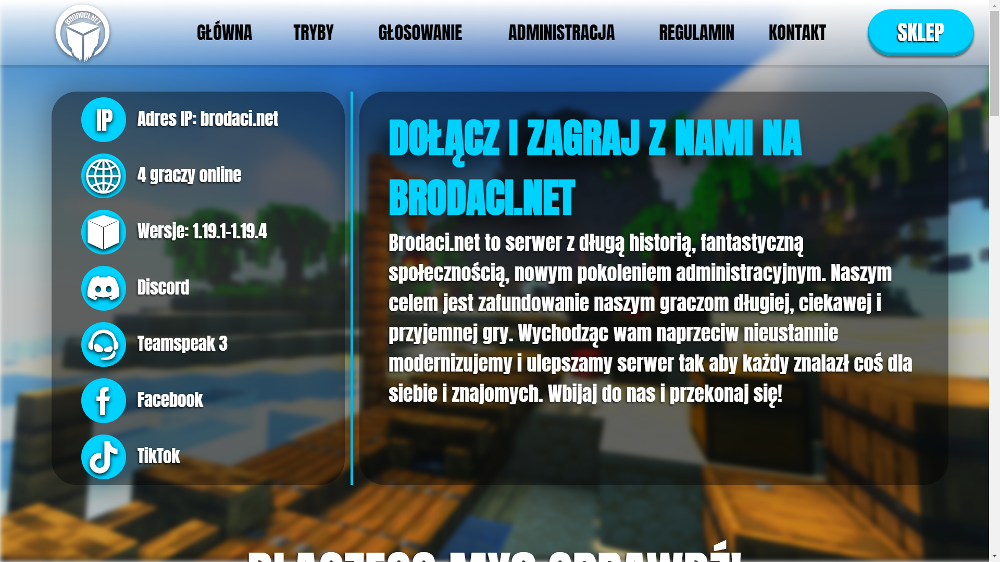
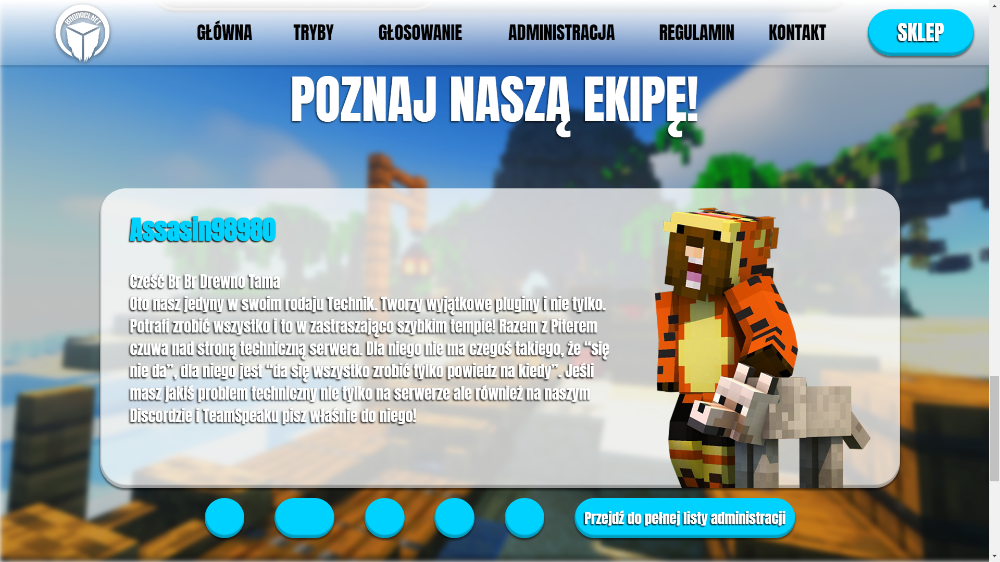
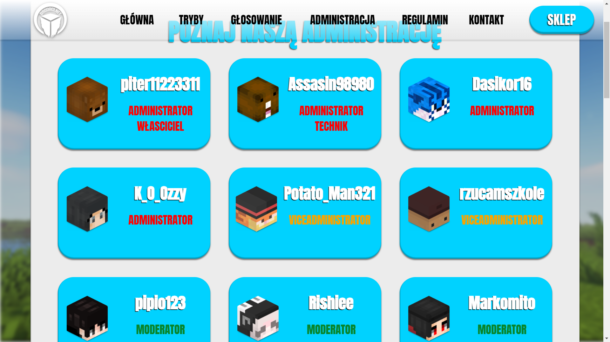
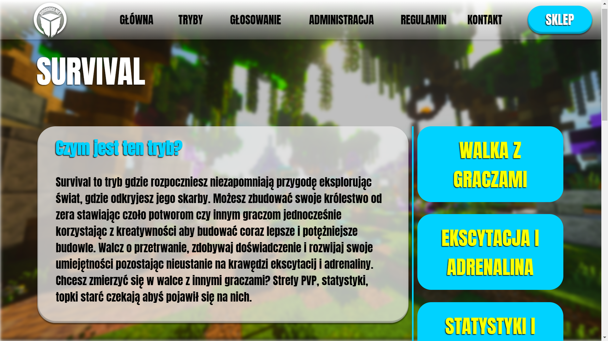

# Brodaci.net
Brodaci.net website  
Project and graphics: Karolina Osińska  
Realization: [GitHub (qWojtpl)](https://github.com/qWojtpl) 

## Features:
<ul>
  <li>Cache system</li>
  <li>Pages loader, variable system</li>
  <li>Connecting with API to get number of players on the server</li>
</ul>

### Disclaimer: I'm not the owner of Brodaci.net server, this repository only contain the website, which was made to order. Every information introduces the actual public website look from 13.09.2023.

## Screenshots

